# 设计模式

> 整理自课件目录：02策略模式 ~ 09结构型模式，按照课件中的顺序排列。

---

## 目录

- **一、创建型模式**：简单工厂 · 工厂方法 · 抽象工厂 · 单例 · 建造者 · 原型
- **二、行为型模式**：策略 · 状态 · 命令 · 观察者 · 中介者 · 模板方法 · 迭代器
- **三、结构型模式**：适配器 · 组合 · 桥接 · 装饰 · 外观 · 享元 · 代理

---

## 设计原则回顾

课件中涉及的面向对象设计原则（在策略模式中总结）：

1. **封装变化**（Encapsulate what varies）：找出应用中可能需要变化之处，把它们独立出来，不要和那些不需要变化的代码混在一起。
2. **针对接口编程，而不是针对实现编程**（Program to an interface, not an implementation）：变量的声明类型应该是超类型（抽象类或接口），使得实际对象可以是任何具体实现。
3. **多用组合，少用继承**（Favor composition over inheritance）：组合提供了更大的灵活性，不仅可以将算法族封装成独立的类，还可以在运行时动态改变行为。
4. **单一职责原则**（Single Responsibility Principle）：一个类应该只有一个引起变化的原因。（见迭代器模式）

---

## 一、创建型模式

> 创建型模式抽象了实例化过程。它们帮助一个系统独立于如何创建、组合和表示它的那些对象。

**参考课件**：`03工厂模式.pdf`、`04创建型模式.pdf`、`补充-单例模式.pdf`

---

### 1.1 简单工厂模式

**参考课件**：`03工厂模式.pdf`

#### 定义

简单工厂模式（Simple Factory Pattern），又称为静态工厂方法（Static Factory Method）模式，属于**类创建型模式**。在简单工厂模式中，可以根据参数的不同返回不同类的实例。简单工厂模式专门定义一个类来负责创建其他类的实例，被创建的实例通常都具有共同的父类。

#### UML 类图

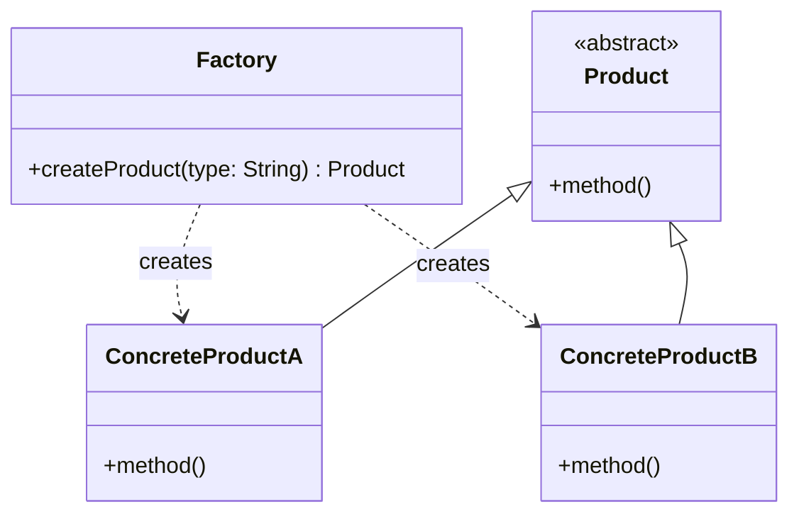
```mermaid
classDiagram
    class Factory {
        +createProduct(type: String) Product
    }
    class Product {
        <<abstract>>
        +method()
    }
    class ConcreteProductA {
        +method()
    }
    class ConcreteProductB {
        +method()
    }

    Factory ..> ConcreteProductA : creates
    Factory ..> ConcreteProductB : creates
    Product <|-- ConcreteProductA
    Product <|-- ConcreteProductB
```

#### 模式角色

| 角色 | 说明 |
|------|------|
| **Factory（工厂角色）** | 负责创建所有产品的实例，包含必要的判断逻辑 |
| **Product（抽象产品角色）** | 所创建对象的父类，描述所有实例的公共接口 |
| **ConcreteProduct（具体产品角色）** | 工厂创建的目标对象 |

#### 优点

- 工厂类含有必要的判断逻辑，可以决定在什么时候创建哪一个产品类的实例，客户端可以免除直接创建产品对象的责任
- 客户端无须知道所创建的具体产品类的类名，只需要知道具体产品类所对应的参数即可
- 通过引入配置文件，可以在不修改任何客户端代码的情况下更换和增加新的具体产品类

#### 缺点

- 工厂类集中了所有产品创建逻辑，一旦不能正常工作，整个系统都要受到影响
- 会增加系统中类的个数，增加系统的复杂度和理解难度
- 系统扩展困难，一旦添加新产品就不得不修改工厂逻辑，违背**开闭原则**
- 由于使用了静态工厂方法，造成工厂角色无法形成基于继承的等级结构

#### 适用场景

- 工厂类负责创建的对象**比较少**，不会造成工厂方法中的业务逻辑太过复杂
- 客户端只知道传入工厂类的参数，对于如何创建对象不关心

---

### 1.2 工厂方法模式

**参考课件**：`03工厂模式.pdf`

#### 定义

工厂方法模式（Factory Method Pattern），又称为工厂模式、虚拟构造器（Virtual Constructor）模式或多态工厂（Polymorphic Factory）模式，属于**类创建型模式**。在工厂方法模式中，工厂父类负责定义创建产品对象的公共接口，而工厂子类则负责生成具体的产品对象，这样做的目的是**将产品类的实例化操作延迟到工厂子类中完成**，即通过工厂子类来确定究竟应该实例化哪一个具体产品类。

#### UML 类图

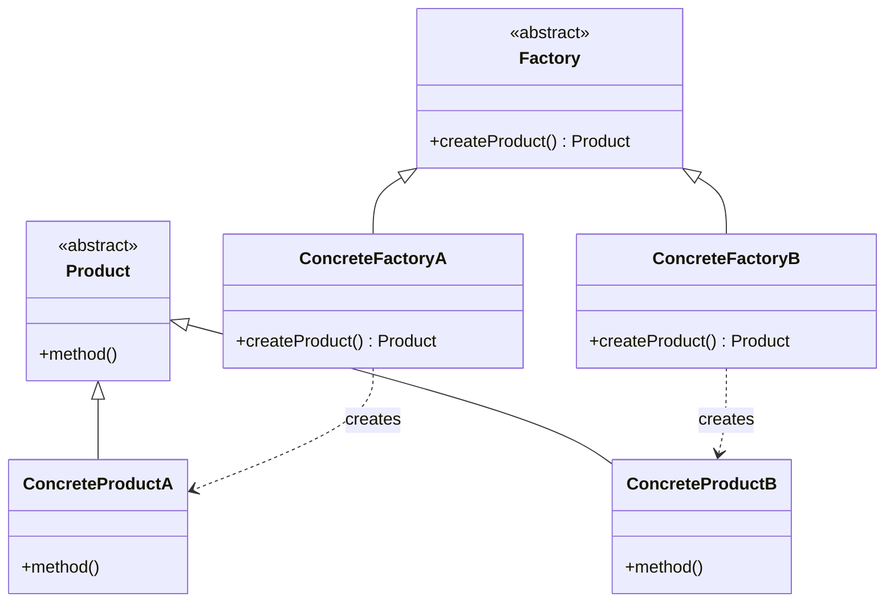
```mermaid
classDiagram
    class Product {
        <<abstract>>
        +method()
    }
    class ConcreteProductA {
        +method()
    }
    class ConcreteProductB {
        +method()
    }
    class Factory {
        <<abstract>>
        +createProduct() Product
    }
    class ConcreteFactoryA {
        +createProduct() Product
    }
    class ConcreteFactoryB {
        +createProduct() Product
    }

    Product <|-- ConcreteProductA
    Product <|-- ConcreteProductB
    Factory <|-- ConcreteFactoryA
    Factory <|-- ConcreteFactoryB
    ConcreteFactoryA ..> ConcreteProductA : creates
    ConcreteFactoryB ..> ConcreteProductB : creates
```

#### 模式角色

| 角色 | 说明 |
|------|------|
| **Product（抽象产品）** | 定义产品的接口 |
| **ConcreteProduct（具体产品）** | 实现抽象产品接口的具体产品 |
| **Factory（抽象工厂）** | 声明工厂方法，返回 Product 类型对象 |
| **ConcreteFactory（具体工厂）** | 重定义工厂方法，返回一个 ConcreteProduct 实例 |

#### 优点

- 工厂方法用来创建客户所需要的产品，同时向客户隐藏了哪种具体产品类将被实例化这一细节
- 基于工厂角色和产品角色的**多态性设计**是工厂方法模式的关键，使工厂可以自主确定创建何种产品对象
- 在系统中加入新产品时，无须修改抽象工厂和抽象产品提供的接口，无须修改客户端，也无须修改其他的具体工厂和具体产品，只要添加一个具体工厂和具体产品即可，完全符合**开闭原则**

#### 缺点

- 添加新产品时，需要编写新的具体产品类和对应的具体工厂类，系统中类的个数将**成对增加**
- 需要引入抽象层，增加了系统的抽象性和理解难度，且在实现时可能需要用到 DOM、反射等技术

#### 适用场景

- 一个类不知道它所需要的对象的类：客户端不需要知道具体产品类的类名，只需要知道所对应的工厂即可
- 一个类通过其子类来指定创建哪个对象：利用面向对象的多态性和里氏代换原则
- 将创建对象的任务委托给多个工厂子类中的某一个，可将具体工厂类的类名存储在配置文件或数据库中

---

### 1.3 抽象工厂模式

**参考课件**：`03工厂模式.pdf`

#### 定义

抽象工厂模式（Abstract Factory Pattern），又称为 Kit 模式，属于**对象创建型模式**。提供一个创建一系列相关或相互依赖对象的接口，而无须指定它们具体的类。

> Abstract Factory Pattern: Provide an interface for creating families of related or dependent objects without specifying their concrete classes.

#### 核心概念

- **产品等级结构**：产品的继承结构，如抽象电视机与具体品牌（海尔、TCL）电视机之间构成一个产品等级结构
- **产品族**：指由同一个工厂生产的、位于不同产品等级结构中的一组产品，如海尔工厂生产的海尔电视机、海尔电冰箱构成一个产品族

抽象工厂模式与工厂方法模式最大的区别在于：**工厂方法模式针对的是一个产品等级结构，而抽象工厂模式需要面对多个产品等级结构**。

#### UML 类图

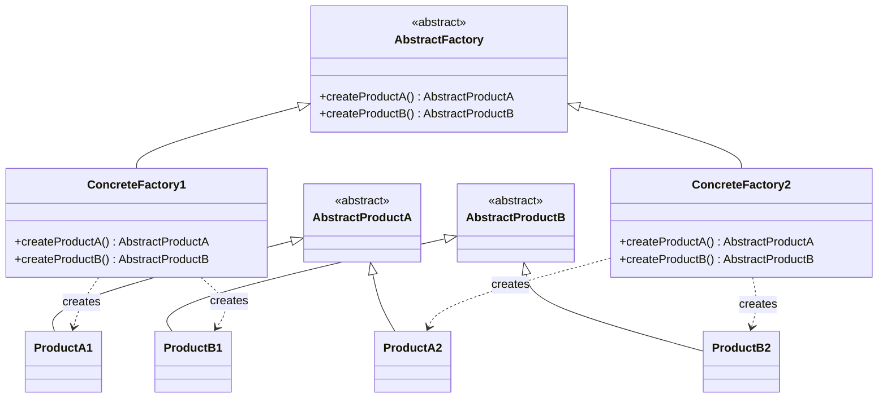
```mermaid
classDiagram
    class AbstractFactory {
        <<abstract>>
        +createProductA() AbstractProductA
        +createProductB() AbstractProductB
    }
    class ConcreteFactory1 {
        +createProductA() AbstractProductA
        +createProductB() AbstractProductB
    }
    class ConcreteFactory2 {
        +createProductA() AbstractProductA
        +createProductB() AbstractProductB
    }
    class AbstractProductA {
        <<abstract>>
    }
    class ProductA1
    class ProductA2
    class AbstractProductB {
        <<abstract>>
    }
    class ProductB1
    class ProductB2

    AbstractFactory <|-- ConcreteFactory1
    AbstractFactory <|-- ConcreteFactory2
    AbstractProductA <|-- ProductA1
    AbstractProductA <|-- ProductA2
    AbstractProductB <|-- ProductB1
    AbstractProductB <|-- ProductB2
    ConcreteFactory1 ..> ProductA1 : creates
    ConcreteFactory1 ..> ProductB1 : creates
    ConcreteFactory2 ..> ProductA2 : creates
    ConcreteFactory2 ..> ProductB2 : creates
```

#### 模式角色

| 角色 | 说明 |
|------|------|
| **AbstractFactory（抽象工厂）** | 声明生成抽象产品的方法 |
| **ConcreteFactory（具体工厂）** | 实现生成具体产品的方法 |
| **AbstractProduct（抽象产品）** | 为每种产品声明接口 |
| **Product（具体产品）** | 定义具体工厂生产的具体产品对象 |

#### 优点

- 隔离了具体类的生成，更换一个具体工厂就变得相对容易，可以在某种程度上改变整个软件系统的行为
- 当一个产品族中的多个对象被设计成一起工作时，能够保证客户端始终只使用同一个产品族中的对象
- 增加新的具体工厂和产品族很方便，无须修改已有系统，符合**开闭原则**

#### 缺点

- 在添加新的产品对象（新的产品等级结构）时，难以扩展抽象工厂来生产新种类的产品，需要对抽象工厂角色及其所有子类进行修改
- **开闭原则的倾斜性**：增加新的工厂和产品族容易，增加新的产品等级结构麻烦

#### 适用场景

- 一个系统不应当依赖于产品类实例如何被创建、组合和表达的细节
- 系统中有多于一个的产品族，而每次只使用其中某一产品族
- 属于同一个产品族的产品将在一起使用
- 系统提供一个产品类的库，所有的产品以同样的接口出现，从而使客户端不依赖于具体实现

#### 模式退化

- 当抽象工厂模式中每一个具体工厂类只创建一个产品对象（只存在一个产品等级结构）时，退化成**工厂方法模式**
- 当工厂方法模式中抽象工厂与具体工厂合并为统一的工厂且工厂方法为静态时，退化成**简单工厂模式**

---

### 1.4 单例模式

**参考课件**：`补充-单例模式.pdf`

#### 定义

单例模式（Singleton Pattern）：保证一个类仅有一个实例，并提供一个全局访问点来访问该实例。

#### UML 类图

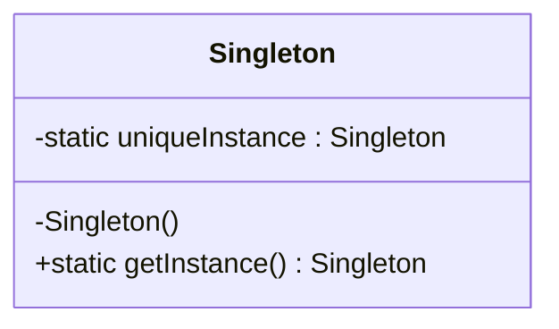
```mermaid
classDiagram
    class Singleton {
        -static uniqueInstance : Singleton
        -Singleton()
        +static getInstance() Singleton
    }
```

#### 多线程实现

| 方法 | 说明 |
|------|------|
| **synchronized 关键字** | 在 `getInstance()` 方法上使用 `synchronized` 保证线程安全 |
| **提前创建实例（饿汉式）** | 在静态初始化器中创建实例，避免延迟创建带来的多线程问题 |
| **双重检查锁定** | 使用双重检查来减少 `getInstance()` 方法中同步机制的使用，仅在实例为 null 时同步 |

#### 优缺点

课件中未展开详述。一般来说：
- **优点**：控制实例数目，节约系统资源；提供全局访问点
- **缺点**：扩展困难；单例类的职责过重，一定程度上违背单一职责原则

#### 适用场景

- 系统只需要一个实例对象
- 客户调用类的单个实例只允许使用一个公共访问点

---

### 1.5 建造者模式

**参考课件**：`04创建型模式.pdf`

#### 定义

建造者模式（Builder Pattern）：将一个复杂对象的构建与它的表示分离，使得同样的构建过程可以创建不同的表示。

> Builder Pattern: Separate the construction of a complex object from its representation so that the same construction process can create different representations.

建造者模式是一步一步创建一个复杂的对象，它允许用户只通过指定复杂对象的类型和内容就可以构建它们，用户不需要知道内部的具体构建细节。属于**对象创建型模式**，又称为生成器模式。

#### UML 类图

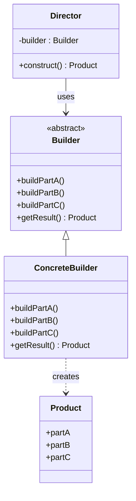
```mermaid
classDiagram
    class Director {
        -builder : Builder
        +construct() Product
    }
    class Builder {
        <<abstract>>
        +buildPartA()
        +buildPartB()
        +buildPartC()
        +getResult() Product
    }
    class ConcreteBuilder {
        +buildPartA()
        +buildPartB()
        +buildPartC()
        +getResult() Product
    }
    class Product {
        +partA
        +partB
        +partC
    }

    Director --> Builder : uses
    Builder <|-- ConcreteBuilder
    ConcreteBuilder ..> Product : creates
```

#### 模式角色

| 角色 | 说明 |
|------|------|
| **Builder（抽象建造者）** | 定义产品的创建方法和返回方法 |
| **ConcreteBuilder（具体建造者）** | 实现抽象建造者接口，实现各个部件的构造和装配方法 |
| **Director（指挥者）** | 隔离客户与生产过程，控制产品的生成过程，针对抽象建造者编程 |
| **Product（产品角色）** | 被构建的复杂对象，包含多个组成部件 |

#### 优点

- 客户端不必知道产品内部组成的细节，将产品本身与产品的创建过程解耦
- 每一个具体建造者都相对独立，可以很方便地替换或增加，符合**开闭原则**
- 可以更加精细地控制产品的创建过程
- 增加新的具体建造者无须修改原有类库的代码

#### 缺点

- 建造者模式所创建的产品一般具有较多的共同点，如果产品之间的差异性很大，则不适合使用
- 如果产品的内部变化复杂，可能会导致需要定义很多具体建造者类，导致系统变得很庞大

#### 适用场景

- 需要生成的产品对象有复杂的内部结构，通常包含多个成员属性
- 需要生成的产品对象的属性相互依赖，需要指定其生成顺序
- 对象的创建过程独立于创建该对象的类
- 隔离复杂对象的创建和使用，并使得相同的创建过程可以创建不同的产品

#### 与抽象工厂模式的区别

- 建造者模式返回一个**组装好的完整产品**，抽象工厂模式返回**一系列相关的产品**（产品族）
- 抽象工厂模式：汽车配件生产工厂 → 建造者模式：汽车组装工厂
- 建造者模式通过指挥者类指导生成对象，侧重于一步步构造复杂对象

---

### 1.6 原型模式

**参考课件**：`04创建型模式.pdf`

#### 定义

原型模式（Prototype Pattern）：用原型实例指定创建对象的种类，并且通过复制这些原型创建新的对象。原型模式允许一个对象再创建另外一个可定制的对象，无须知道任何创建的细节。

> Prototype Pattern: Specify the kind of objects to create using a prototypical instance, and create new objects by copying this prototype.

原型模式是一种**对象创建型模式**，其基本工作原理是通过将一个原型对象传给那个要发动创建的对象，这个要发动创建的对象通过请求原型对象拷贝原型自己来实现创建过程。

#### UML 类图

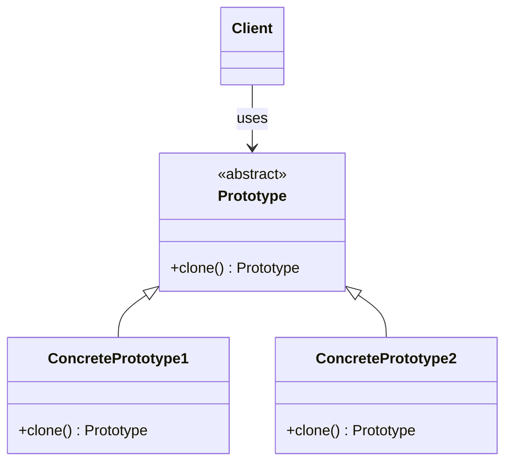
```mermaid
classDiagram
    class Prototype {
        <<abstract>>
        +clone() Prototype
    }
    class ConcretePrototype1 {
        +clone() Prototype
    }
    class ConcretePrototype2 {
        +clone() Prototype
    }
    class Client {
    }

    Prototype <|-- ConcretePrototype1
    Prototype <|-- ConcretePrototype2
    Client --> Prototype : uses
```

#### 模式角色

| 角色 | 说明 |
|------|------|
| **Prototype（抽象原型类）** | 定义具有克隆自己的方法的接口 |
| **ConcretePrototype（具体原型类）** | 实现具体的克隆方法，在克隆方法中返回自己的一个克隆对象 |
| **Client（客户类）** | 让一个原型克隆自身从而创建一个新的对象 |

#### 浅克隆与深克隆

- **浅克隆**：当对象被复制时它所包含的成员对象却没有被复制（Java 中通过覆盖 Object 类的 `clone()` 方法实现）
- **深克隆**：除了对象本身被复制外，对象包含的引用也被复制，即其中的成员对象也将复制

Java 中 `clone()` 方法满足：
1. `x.clone() != x` — 克隆对象与原对象不是同一个对象
2. `x.clone().getClass() == x.getClass()` — 克隆对象与原对象类型一样
3. 如果 `equals()` 方法定义恰当，`x.clone().equals(x)` 成立

#### 优点

- 当创建新的对象实例较为复杂时，可以简化对象的创建过程，提高新实例的创建效率
- 可以动态增加或减少产品类
- 提供了简化的创建结构
- 可以使用深克隆的方式保存对象的状态

#### 缺点

- 需要为每一个类配备一个克隆方法，对已有类进行改造时不一定容易，必须修改其源代码，违背**开闭原则**
- 在实现深克隆时需要编写较为复杂的代码

#### 适用场景

- 创建新对象成本较大，新的对象可以通过原型模式对已有对象进行复制来获得
- 系统要保存对象的状态，而对象的状态变化很小，或者对象本身占内存不大
- 需要避免使用分层次的工厂类来创建分层次的对象，且类的实例对象只有一个或很少几个组合状态

---

## 二、行为型模式

> 行为型模式涉及到算法和对象间职责的分配。行为型模式不仅描述对象或类的模式，还描述它们之间的通信模式。

**参考课件**：`02策略模式.pdf`、`05状态与命令模式.pdf`、`06行为型模式.pdf`、`补充-迭代器模式.pdf`

---

### 2.1 策略模式

**参考课件**：`02策略模式.pdf`

#### 定义

策略模式（Strategy Pattern）：定义一系列算法，把它们一个个封装起来，并且使它们可相互替换。策略模式让算法的变化独立于使用它的客户。

> Strategy Pattern: Define a family of algorithms, encapsulate each one, and make them interchangeable. Strategy lets the algorithm vary independently from clients that use it.

策略模式又称为 Policy（政策）模式。

#### UML 类图

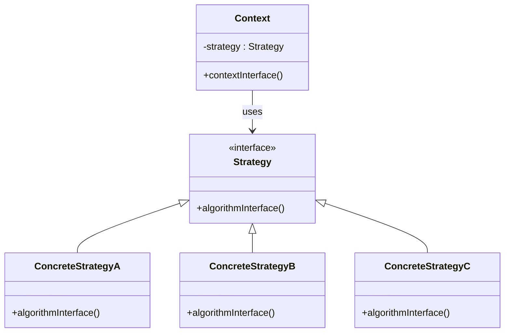
```mermaid
classDiagram
    class Context {
        -strategy : Strategy
        +contextInterface()
    }
    class Strategy {
        <<interface>>
        +algorithmInterface()
    }
    class ConcreteStrategyA {
        +algorithmInterface()
    }
    class ConcreteStrategyB {
        +algorithmInterface()
    }
    class ConcreteStrategyC {
        +algorithmInterface()
    }

    Context --> Strategy : uses
    Strategy <|-- ConcreteStrategyA
    Strategy <|-- ConcreteStrategyB
    Strategy <|-- ConcreteStrategyC
```

#### 模式角色

| 角色 | 说明 |
|------|------|
| **Context（环境类）** | 持有 Strategy 对象的引用，负责调用策略的算法接口 |
| **Strategy（抽象策略类）** | 定义所有支持的算法的公共接口 |
| **ConcreteStrategy（具体策略类）** | 实现具体的算法 |

#### 优点（课件原文：Consequences）

- **相关算法族**：Strategy 类的层次结构为 Context 定义了一系列可供重用的算法或行为。继承有助于析取这些算法中的公共功能
- **子类化的替代方案**：提供了一种替代继承的方法
- **消除条件语句**：策略模式消除了条件语句
- **实现的选择**：策略可以提供相同行为的不同实现，客户可以根据时间/空间权衡选择不同策略

#### 缺点（课件原文：Consequences）

- **客户端必须了解不同的策略**：客户必须理解每种策略的区别才能选择合适的策略
- **Strategy 和 Context 之间的通信开销**
- **增加了对象的数目**

#### 适用场景

- 许多相关的类仅仅是**行为有异**，策略提供了一种用多个行为中的一个行为来配置一个类的方法
- 需要使用一个算法的**不同变体**
- 算法使用客户**不应该知道**的数据，可使用策略模式以避免暴露复杂的、与算法相关的数据结构
- 一个类定义了多种行为，并且这些行为在这个类的操作中以**多个条件语句**的形式出现，可将相关的条件分支移入它们各自的 Strategy 类中

---

### 2.2 状态模式

**参考课件**：`05状态与命令模式.pdf`

#### 定义

状态模式（State Pattern）：允许一个对象在其内部状态改变时改变它的行为，对象看起来似乎修改了它的类。其别名为状态对象（Objects for States），是一种**对象行为型模式**。

> State Pattern: Allow an object to alter its behavior when its internal state changes. The object will appear to change its class.

#### UML 类图

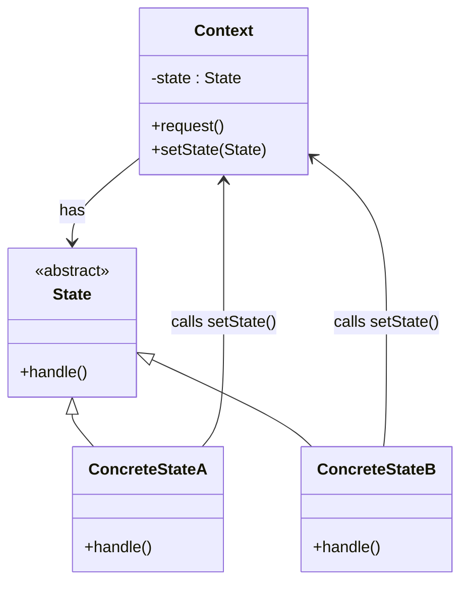
```mermaid
classDiagram
    class Context {
        -state : State
        +request()
        +setState(State)
    }
    class State {
        <<abstract>>
        +handle()
    }
    class ConcreteStateA {
        +handle()
    }
    class ConcreteStateB {
        +handle()
    }

    Context --> State : has
    State <|-- ConcreteStateA
    State <|-- ConcreteStateB
    ConcreteStateA --> Context : calls setState()
    ConcreteStateB --> Context : calls setState()
```

#### 模式角色

| 角色 | 说明 |
|------|------|
| **Context（环境类）** | 拥有状态的对象，维护一个抽象状态类实例，可以在环境类中对状态进行切换 |
| **State（抽象状态类）** | 定义接口以封装与 Context 的一个特定状态相关的行为 |
| **ConcreteState（具体状态类）** | 每一个子类实现与环境类的一个状态相关的行为 |

#### 优点

- 封装了转换规则
- 枚举可能的状态，在枚举状态之前需要确定状态种类
- 将所有与某个状态有关的行为放到一个类中，方便增加新的状态
- 允许状态转换逻辑与状态对象合成一体，而不是一个巨大的条件语句块
- 可以让多个环境对象共享一个状态对象，减少系统中对象的个数

#### 缺点

- 会增加系统类和对象的个数
- 结构与实现都较为复杂，如果使用不当将导致程序结构和代码的混乱
- 对**开闭原则**的支持并不太好：对于可切换状态的状态模式，增加新的状态类需要修改那些负责状态转换的源代码

#### 适用场景

- 对象的行为依赖于它的状态（属性）并且可以根据它的状态改变而改变它的相关行为
- 代码中包含大量与对象状态有关的条件语句，导致代码的可维护性和灵活性变差

#### 模式扩展

- **简单状态模式**：状态相互独立，无须进行转换，符合**开闭原则**
- **可切换状态的状态模式**：大多数状态模式是可以切换的，增加新状态类可能需要修改其他状态类甚至环境类

---

### 2.3 命令模式

**参考课件**：`05状态与命令模式.pdf`

#### 定义

命令模式（Command Pattern）：将一个请求封装为一个对象，从而使我们可用不同的请求对客户进行参数化；对请求排队或者记录请求日志，以及支持可撤销的操作。命令模式是一种**对象行为型模式**，其别名为动作（Action）模式或事务（Transaction）模式。

> Command Pattern: Encapsulate a request as an object, thereby letting you parameterize clients with different requests, queue or log requests, and support undoable operations.

#### UML 类图

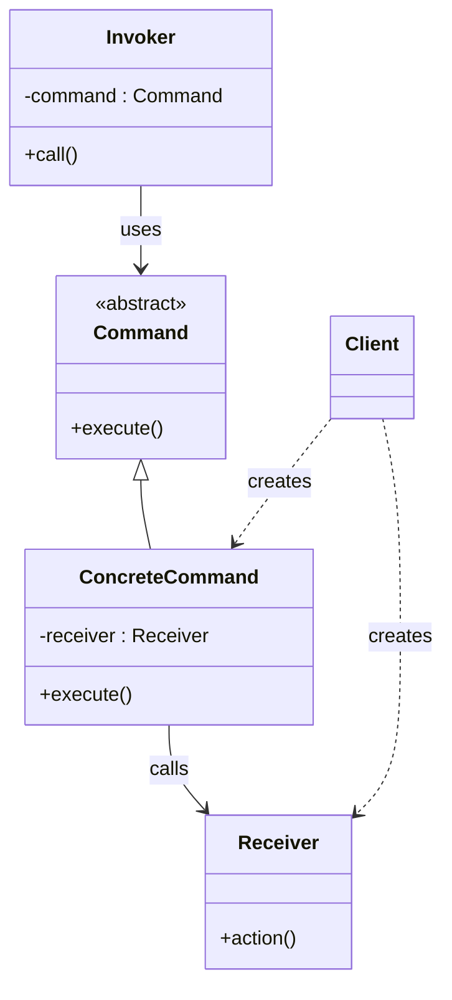
```mermaid
classDiagram
    class Invoker {
        -command : Command
        +call()
    }
    class Command {
        <<abstract>>
        +execute()
    }
    class ConcreteCommand {
        -receiver : Receiver
        +execute()
    }
    class Receiver {
        +action()
    }
    class Client {
    }

    Invoker --> Command : uses
    Command <|-- ConcreteCommand
    ConcreteCommand --> Receiver : calls
    Client ..> Receiver : creates
    Client ..> ConcreteCommand : creates
```

#### 模式角色

| 角色 | 说明 |
|------|------|
| **Command（抽象命令类）** | 声明用于执行请求的 `execute()` 等方法 |
| **ConcreteCommand（具体命令类）** | 实现抽象命令类声明的方法，对应具体的接收者对象，将接收者对象的动作绑定其中 |
| **Invoker（调用者）** | 请求的发送者，通过命令对象来执行请求 |
| **Receiver（接收者）** | 执行与请求相关的操作，具体实现对请求的业务处理 |
| **Client（客户类）** | 创建具体命令对象并设置其接收者 |

#### 优点

- 降低系统的耦合度
- 新的命令可以很容易地加入到系统中
- 可以比较容易地设计一个命令队列和宏命令（组合命令）
- 可以方便地实现对请求的 Undo 和 Redo

#### 缺点

- 可能会导致某些系统有过多的具体命令类。因为针对每一个命令都需要设计一个具体命令类

#### 适用场景

- 系统需要将请求调用者和请求接收者解耦，使得调用者和接收者不直接交互
- 系统需要在不同的时间指定请求、将请求排队和执行请求
- 系统需要支持命令的撤销（Undo）和恢复（Redo）操作
- 系统需要将一组操作组合在一起，即支持**宏命令**

#### 模式扩展

- **宏命令**（组合命令）：命令模式和组合模式联用的产物，宏命令包含对其他命令对象的引用，执行一个宏命令将执行多个具体命令
- **撤销操作**：在具体命令类中增加 `undo()` 方法

---

### 2.4 观察者模式

**参考课件**：`06行为型模式.pdf`

#### 定义

观察者模式（Observer Pattern）：定义对象间的一种一对多依赖关系，使得每当一个对象状态发生改变时，其相关依赖对象皆得到通知并被自动更新。

观察者模式又叫做**发布-订阅（Publish/Subscribe）模式**、**模型-视图（Model/View）模式**、**源-监听器（Source/Listener）模式**或**从属者（Dependents）模式**。是一种**对象行为型模式**。

> Observer Pattern: Define a one-to-many dependency between objects so that when one object changes state, all its dependents are notified and updated automatically.

#### UML 类图

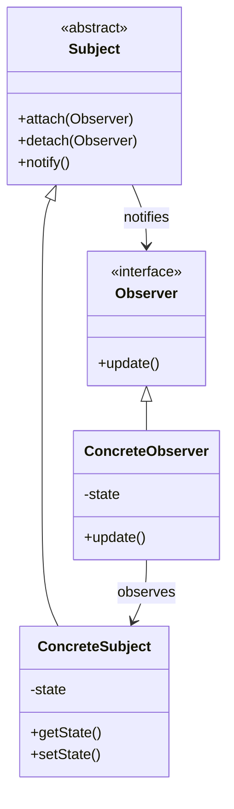
```mermaid
classDiagram
    class Subject {
        <<abstract>>
        +attach(Observer)
        +detach(Observer)
        +notify()
    }
    class ConcreteSubject {
        -state
        +getState()
        +setState()
    }
    class Observer {
        <<interface>>
        +update()
    }
    class ConcreteObserver {
        -state
        +update()
    }

    Subject <|-- ConcreteSubject
    Observer <|-- ConcreteObserver
    Subject --> Observer : notifies
    ConcreteObserver --> ConcreteSubject : observes
```

#### 模式角色

| 角色 | 说明 |
|------|------|
| **Subject（目标）** | 被观察的对象，提供增加/删除观察者、通知所有观察者的方法 |
| **ConcreteSubject（具体目标）** | 包含经常发生改变的数据，当状态改变时向各个观察者发出通知 |
| **Observer（观察者）** | 对观察目标的改变做出反应的接口 |
| **ConcreteObserver（具体观察者）** | 维护指向具体目标对象的引用，存储与目标状态保持一致的状态 |

#### 优点

- 可以实现表示层和数据逻辑层的分离，定义了稳定的消息更新传递机制
- 在观察目标和观察者之间建立一个抽象的耦合
- 支持广播通信
- 符合**开闭原则**

#### 缺点

- 如果一个观察目标对象有很多直接和间接的观察者，将所有的观察者都通知到会花费很多时间
- 如果在观察者和观察目标之间有循环依赖，观察目标会触发循环调用，可能导致系统崩溃
- 观察者模式没有相应的机制让观察者知道所观察的目标对象是怎么发生变化的，仅仅知道发生了变化

#### 适用场景

- 一个抽象模型有两个方面，其中一个方面依赖于另一个方面，将这些方面封装在独立的对象中
- 一个对象的改变将导致其他一个或多个对象也发生改变，而不知道具体有多少对象将发生改变
- 一个对象必须通知其他对象，而并不知道这些对象是谁
- 需要在系统中创建一个触发链（A→B→C→...）

#### 模式扩展

- **MVC 模式**：观察者模式可以用来实现 MVC 模式，观察目标 = Model，观察者 = View，Controller 充当两者之间的中介者
- **响应式编程**：以数据流和变化传播为核心的编程范式

---

### 2.5 中介者模式

**参考课件**：`06行为型模式.pdf`

#### 定义

中介者模式（Mediator Pattern）：用一个中介对象来封装一系列的对象交互，中介者使各对象不需要显式地相互引用，从而使其耦合松散，而且可以独立地改变它们之间的交互。中介者模式又称为调停者模式，是一种**对象行为型模式**。

> Mediator Pattern: Define an object that encapsulates how a set of objects interact. Mediator promotes loose coupling by keeping objects from referring to each other explicitly, and it lets you vary their interaction independently.

#### UML 类图

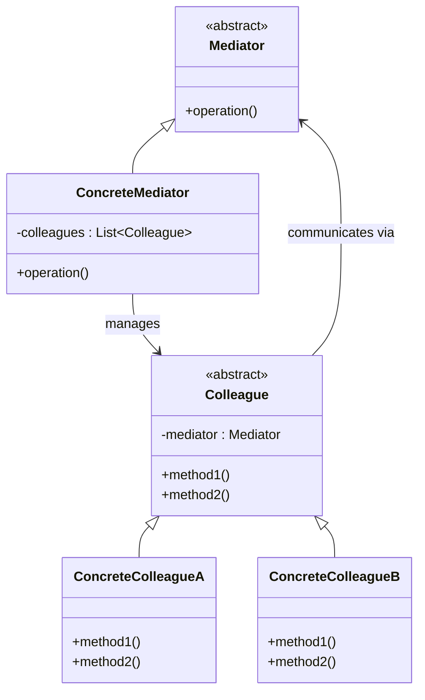
```mermaid
classDiagram
    class Mediator {
        <<abstract>>
        +operation()
    }
    class ConcreteMediator {
        -colleagues : List~Colleague~
        +operation()
    }
    class Colleague {
        <<abstract>>
        -mediator : Mediator
        +method1()
        +method2()
    }
    class ConcreteColleagueA {
        +method1()
        +method2()
    }
    class ConcreteColleagueB {
        +method1()
        +method2()
    }

    Mediator <|-- ConcreteMediator
    Colleague <|-- ConcreteColleagueA
    Colleague <|-- ConcreteColleagueB
    ConcreteMediator --> Colleague : manages
    Colleague --> Mediator : communicates via
```

#### 模式角色

| 角色 | 说明 |
|------|------|
| **Mediator（抽象中介者）** | 定义与各同事对象之间的通信接口 |
| **ConcreteMediator（具体中介者）** | 通过协调各个同事对象实现协作行为，了解并维护各个同事对象的引用 |
| **Colleague（抽象同事类）** | 定义各同事的公有方法，维护一个指向中介者对象的引用 |
| **ConcreteColleague（具体同事类）** | 每个同事对象在需要与其他同事通信时，先与中介者通信，通过中介者间接完成 |

#### 中介者的双重职责

1. **中转作用（结构性）**：各个同事对象不再需要显式引用其他同事，通过中介者即可
2. **协调作用（行为性）**：对同事之间的关系进行封装，同事可以一致地与中介者交互

通过引入中介者对象，系统的网状结构变为以中介者为中心的**星形结构**。

#### 优点

- 简化了对象之间的交互
- 将各同事解耦
- 减少子类生成
- 可以简化各同事类的设计和实现

#### 缺点

- 在具体中介者类中包含了同事之间的交互细节，可能会导致具体中介者类非常复杂，使得系统难以维护

#### 适用场景

- 系统中对象之间存在复杂的引用关系，产生的相互依赖关系结构混乱且难以理解
- 一个对象由于引用了其他很多对象并且直接和这些对象通信，导致难以复用该对象
- 想通过一个中间类来封装多个类中的行为，而又不想生成太多的子类

#### 与设计原则的关系

中介者模式是**迪米特法则**的典型应用，通过创造出一个中介者对象，将系统中有关的对象所引用的其他对象数目减少到最少。

---

### 2.6 模板方法模式

**参考课件**：`06行为型模式.pdf`

#### 定义

模板方法模式（Template Method Pattern）：定义一个操作中算法的骨架，而将一些步骤延迟到子类中，模板方法使得子类可以不改变一个算法的结构即可重定义该算法的某些特定步骤。模板方法是一种**类行为型模式**。

> Template Method Pattern: Define the skeleton of an algorithm in an operation, deferring some steps to subclasses. Template Method lets subclasses redefine certain steps of an algorithm without changing the algorithm's structure.

#### UML 类图

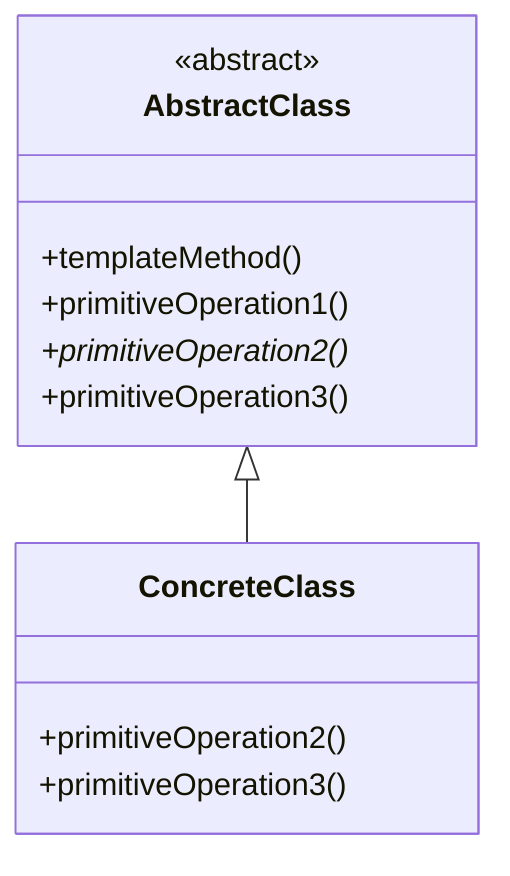
```mermaid
classDiagram
    class AbstractClass {
        <<abstract>>
        +templateMethod()
        +primitiveOperation1()
        +primitiveOperation2()*
        +primitiveOperation3()
    }
    class ConcreteClass {
        +primitiveOperation2()
        +primitiveOperation3()
    }

    AbstractClass <|-- ConcreteClass
```

#### 模式角色

| 角色 | 说明 |
|------|------|
| **AbstractClass（抽象类）** | 定义一系列基本操作，实现模板方法（算法的骨架） |
| **ConcreteClass（具体子类）** | 实现在父类中定义的抽象基本操作，也可以覆盖在父类中实现的具体基本操作 |

#### 方法分类

| 方法类型 | 说明 |
|----------|------|
| **模板方法（Template Method）** | 定义在抽象类中，把基本操作方法组合在一起形成总算法 |
| **基本方法 - 抽象方法** | 子类必须实现的方法 |
| **基本方法 - 具体方法** | 父类提供默认实现 |
| **基本方法 - 钩子方法（Hook Method）** | 空方法或有默认返回值（如 `boolean`），子类可选择性覆盖以控制父类行为 |

#### 优点

- 模板方法模式在一个类中抽象地定义算法，而由它的子类实现细节的处理
- 是一种代码复用的基本技术
- 导致一种反向的控制结构，通过父类调用其子类的操作，通过对子类的扩展增加新的行为，符合**开闭原则**

#### 缺点

- 每个不同的实现都需要定义一个子类，这会导致类的个数增加，系统更加庞大

#### 适用场景

- 一次性实现一个算法的不变部分，并将可变的行为留给子类来实现
- 各子类中公共的行为应被提取出来并集中到一个公共父类中以避免代码重复
- 对一些复杂的算法进行分割，将其算法中固定不变的部分设计为模板方法，可变的细节由子类实现
- 控制子类的扩展

#### 好莱坞原则

> "Don't call us, we'll call you."（不要给我们打电话，我们会给你打电话）

在模板方法模式中，子类不显式调用父类的方法，而是通过覆盖父类的方法实现具体的业务逻辑，**父类控制对子类的调用**。

---

### 2.7 迭代器模式

**参考课件**：`补充-迭代器模式.pdf`

#### 定义

迭代器模式（Iterator Pattern）：提供一种方法顺序访问一个聚合对象中的各个元素，而又不暴露其内部的表示。

> Iterator Pattern: Provides a way to access the elements of an aggregate object sequentially without exposing its underlying representation.

迭代器模式将遍历的任务放在迭代器对象上，而不是聚合对象上，从而简化了聚合的接口和实现，并将责任放在了它应该在的地方。

#### UML 类图

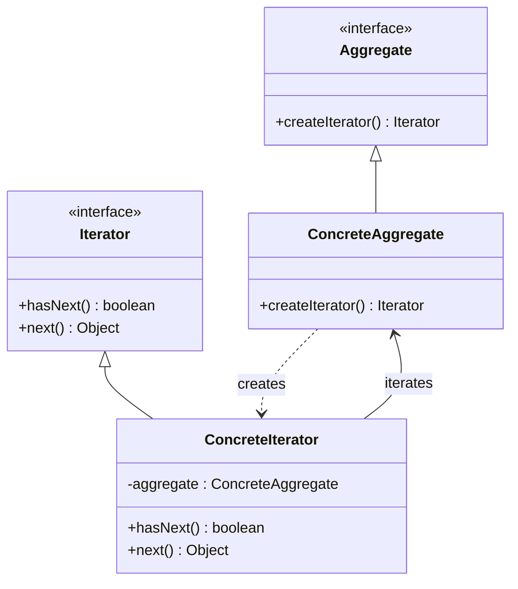
```mermaid
classDiagram
    class Aggregate {
        <<interface>>
        +createIterator() Iterator
    }
    class ConcreteAggregate {
        +createIterator() Iterator
    }
    class Iterator {
        <<interface>>
        +hasNext() boolean
        +next() Object
    }
    class ConcreteIterator {
        -aggregate : ConcreteAggregate
        +hasNext() boolean
        +next() Object
    }

    Aggregate <|-- ConcreteAggregate
    Iterator <|-- ConcreteIterator
    ConcreteIterator --> ConcreteAggregate : iterates
    ConcreteAggregate ..> ConcreteIterator : creates
```

#### 模式角色

| 角色 | 说明 |
|------|------|
| **Iterator（抽象迭代器）** | 定义访问和遍历元素的接口 |
| **ConcreteIterator（具体迭代器）** | 实现迭代器接口，跟踪遍历中的当前位置 |
| **Aggregate（抽象聚合类）** | 定义创建相应迭代器对象的接口 |
| **ConcreteAggregate（具体聚合类）** | 实现创建相应迭代器的接口，返回 ConcreteIterator 实例 |

#### 设计原则 — 单一职责原则

> A class should have only one reason to change.（一个类应该只有一个引起变化的原因）

每个职责都是潜在的变化轴。多于一个职责意味着多于一个变化领域。这个原则指导我们将每个类保持在一个单一的职责上。

---

## 三、结构型模式

> 结构型模式涉及到如何组合类和对象以获得更大的结构。

**参考课件**：`07适配器与组合.pdf`、`08桥接与装饰者.pdf`、`09结构型模式.pdf`

---

### 3.1 适配器模式

**参考课件**：`07适配器与组合.pdf`

#### 定义

适配器模式（Adapter Pattern）：将一个接口转换成客户希望的另一个接口，适配器模式使接口不兼容的那些类可以一起工作，其别名为包装器（Wrapper）。适配器模式既可以作为**类结构型模式**，也可以作为**对象结构型模式**。

> Adapter Pattern: Convert the interface of a class into another interface clients expect. Adapter lets classes work together that couldn't otherwise because of incompatible interfaces.

#### UML 类图

**对象适配器：**

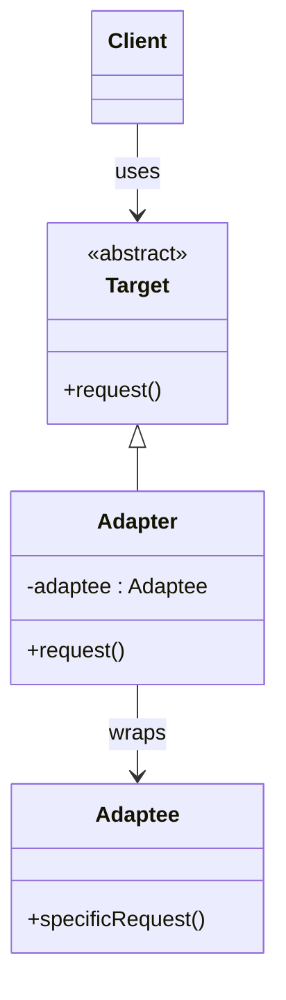
```mermaid
classDiagram
    class Target {
        <<abstract>>
        +request()
    }
    class Adapter {
        -adaptee : Adaptee
        +request()
    }
    class Adaptee {
        +specificRequest()
    }
    class Client {
    }

    Target <|-- Adapter
    Adapter --> Adaptee : wraps
    Client --> Target : uses
```

**类适配器：**

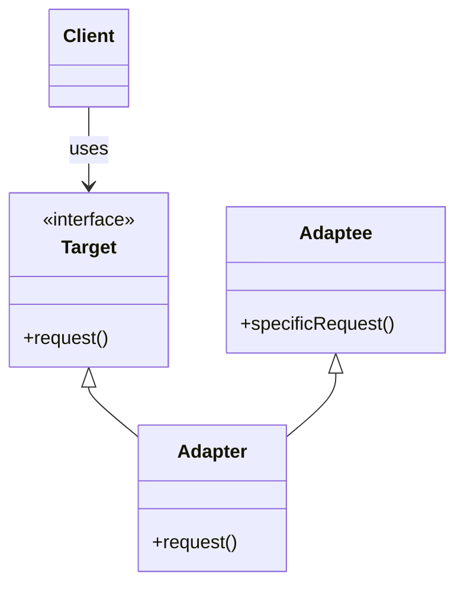
```mermaid
classDiagram
    class Target {
        <<interface>>
        +request()
    }
    class Adapter {
        +request()
    }
    class Adaptee {
        +specificRequest()
    }
    class Client {
    }

    Target <|-- Adapter
    Adaptee <|-- Adapter
    Client --> Target : uses
```

#### 模式角色

| 角色 | 说明 |
|------|------|
| **Target（目标抽象类）** | 定义客户要用的特定领域的接口 |
| **Adapter（适配器类）** | 调用另一个接口，作为转换器，对适配者和目标进行适配 |
| **Adaptee（适配者类）** | 被适配的角色，定义了一个已经存在的接口，需要适配 |
| **Client（客户类）** | 针对目标抽象类进行编程 |

#### 优点

- 将目标类和适配者类解耦，通过引入适配器类重用现有适配者类，无须修改原有代码
- 增加了类的透明性和复用性
- 灵活性和扩展性都非常好，符合**开闭原则**

**类适配器额外优点**：适配器类是适配者类的子类，可以在适配器类中置换一些适配者的方法

**对象适配器额外优点**：一个对象适配器可以把多个不同的适配者适配到同一个目标

#### 缺点

- **类适配器**：对于不支持多重继承的语言，一次最多只能适配一个适配者类；目标只能为抽象类
- **对象适配器**：置换适配者类的方法不容易

#### 适用场景

- 系统需要使用现有的类，而这些类的接口不符合系统的需要
- 想要建立一个可以重复使用的类，用于与一些彼此之间没有太大关联的一些类一起工作

#### 模式扩展

- **默认适配器模式（Default Adapter Pattern）**：当不需要全部实现接口提供的方法时，先设计一个抽象类实现接口并为每个方法提供默认实现（空方法），子类有选择地覆盖父类的方法
- **双向适配器**：在适配器中同时包含对目标类和适配者类的引用，实现双向调用

---

### 3.2 组合模式

**参考课件**：`07适配器与组合.pdf`

#### 定义

组合模式（Composite Pattern）：组合多个对象形成树形结构以表示"整体-部分"的结构层次。组合模式对单个对象（即叶子对象）和组合对象（即容器对象）的使用具有一致性。

组合模式又可以称为**"整体-部分"（Part-Whole）模式**，属于**对象结构型模式**。

> Composite Pattern: Compose objects into tree structures to represent part-whole hierarchies. Composite lets clients treat individual objects and compositions of objects uniformly.

#### UML 类图

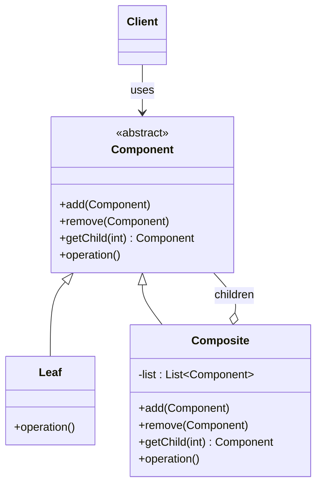
```mermaid
classDiagram
    class Component {
        <<abstract>>
        +add(Component)
        +remove(Component)
        +getChild(int) Component
        +operation()
    }
    class Leaf {
        +operation()
    }
    class Composite {
        -list : List~Component~
        +add(Component)
        +remove(Component)
        +getChild(int) Component
        +operation()
    }
    class Client {
    }

    Component <|-- Leaf
    Component <|-- Composite
    Composite o-- Component : children
    Client --> Component : uses
```

#### 模式角色

| 角色 | 说明 |
|------|------|
| **Component（抽象构件）** | 为叶子构件和容器构件对象声明接口，包含所有子类共有行为的声明和实现 |
| **Leaf（叶子构件）** | 在组合结构中表示叶子节点对象，叶子节点没有子节点 |
| **Composite（容器构件）** | 表示容器节点对象，包含子节点（叶子或容器），提供集合存储子节点 |
| **Client（客户类）** | 针对抽象构件类编程 |

#### 两种实现方式

| 方式 | 说明 |
|------|------|
| **透明组合模式** | 在抽象构件类中声明所有用于管理成员对象的方法（add/remove/getChild），叶子也必须实现这些方法（抛出异常） |
| **安全组合模式** | 在抽象构件类中不声明管理成员对象的方法，只在容器构件类中声明这些方法。但客户端不能完全针对抽象编程 |

#### 优点

- 可以清楚地定义分层次的复杂对象，表示对象的全部或部分层次，增加新构件更容易
- 客户端调用简单，客户端可以一致地使用组合结构或其中单个对象
- 定义了包含叶子对象和容器对象的类层次结构，可以不断递归形成复杂的树形结构
- 更容易在组合体内加入对象构件，客户端不必因加入新对象构件而更改原有代码

#### 缺点

- 使设计变得更加抽象，对象的业务规则如果很复杂，实现组合模式具有很大挑战性
- 增加新构件时可能会产生一些问题，很难对容器中的构件类型进行限制

#### 适用场景

- 需要表示一个对象整体或部分层次，希望通过一种方式忽略整体与部分的差异
- 让客户能够忽略不同对象层次的变化，客户端针对抽象构件编程
- 对象的结构是动态的并且复杂程度不一样，但客户需要一致地处理它们

---

### 3.3 桥接模式

**参考课件**：`08桥接与装饰者.pdf`

#### 定义

桥接模式（Bridge Pattern）：将抽象部分与它的实现部分分离，使它们都可以独立地变化。它是一种**对象结构型模式**，又称为柄体（Handle and Body）模式或接口（Interface）模式。

> Bridge Pattern: Decouple an abstraction from its implementation so that the two can vary independently.

#### 核心概念

- **抽象化**：忽略一些信息，把不同的实体当作同样的实体对待，抽取共同性质的过程
- **实现化**：针对抽象化给出的具体实现
- **脱耦**：将抽象化和实现化之间的耦合解脱开，将继承关系改为关联关系（组合或聚合），使两者可以相对独立地变化

#### UML 类图

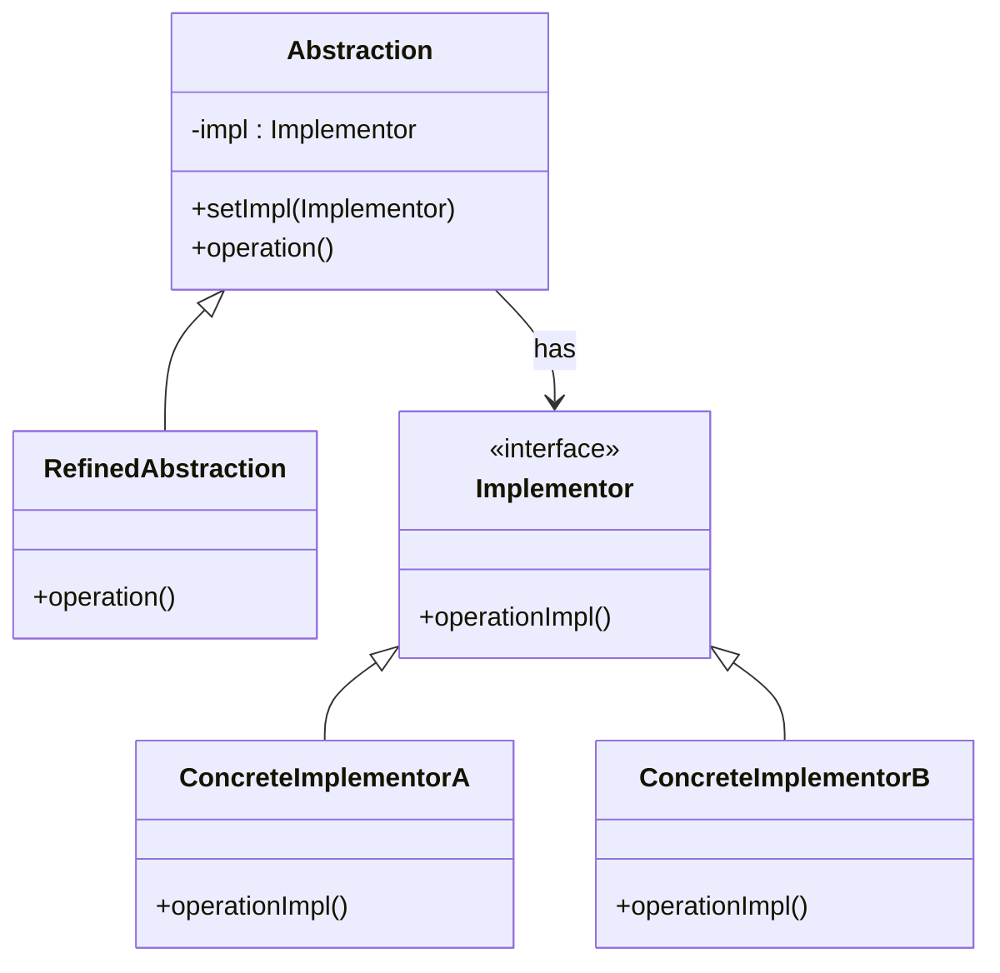
```mermaid
classDiagram
    class Abstraction {
        -impl : Implementor
        +setImpl(Implementor)
        +operation()
    }
    class RefinedAbstraction {
        +operation()
    }
    class Implementor {
        <<interface>>
        +operationImpl()
    }
    class ConcreteImplementorA {
        +operationImpl()
    }
    class ConcreteImplementorB {
        +operationImpl()
    }

    Abstraction <|-- RefinedAbstraction
    Implementor <|-- ConcreteImplementorA
    Implementor <|-- ConcreteImplementorB
    Abstraction --> Implementor : has
```

#### 模式角色

| 角色 | 说明 |
|------|------|
| **Abstraction（抽象类）** | 定义抽象类的接口，维护一个指向 Implementor 类型对象的指针 |
| **RefinedAbstraction（扩充抽象类）** | 扩充由 Abstraction 定义的接口，调用 Implementor 中定义的业务方法 |
| **Implementor（实现类接口）** | 定义实现类的接口，仅提供基本操作 |
| **ConcreteImplementor（具体实现类）** | 实现 Implementor 接口，提供基本操作的不同实现 |

#### 优点

- 分离抽象接口及其实现部分
- 是比多继承方案更好的解决方法（多继承违背类的单一职责原则，复用性差，类的个数庞大）
- 提高了系统的可扩充性，在两个变化维度中任意扩展一个维度，都不需要修改原有系统
- 实现细节对客户透明

#### 缺点

- 引入会增加系统的理解与设计难度
- 要求正确识别出系统中两个独立变化的维度，使用范围具有一定的局限性

#### 适用场景

- 需要在构件的抽象化角色和具体化角色之间增加更多的灵活性，避免在两个层次之间建立静态的继承联系
- 抽象化角色和实现化角色可以以继承的方式独立扩展而互不影响，在程序运行时可以动态组合
- 一个类存在**两个独立变化的维度**，且这两个维度都需要进行扩展
- 设计要求需要独立管理抽象化角色和具体化角色
- 不希望使用继承或因为多层次继承导致系统类的个数急剧增加的系统

#### 与适配器模式的区别

- 桥接模式用于系统的**初步设计**，对于存在两个独立变化维度的类将其分为抽象化和实现化两个角色
- 适配器模式用于初步设计完成之后，当发现系统与已有类无法协同工作时使用
- 桥接是"事前"设计，适配器是"事后"补救

---

### 3.4 装饰模式

**参考课件**：`08桥接与装饰者.pdf`

#### 定义

装饰模式（Decorator Pattern）：动态地给一个对象增加一些额外的职责（Responsibility），就增加对象功能来说，装饰模式比生成子类实现更为灵活。其别名为包装器（Wrapper）。是一种**对象结构型模式**。

> Decorator Pattern: Attach additional responsibilities to an object dynamically. Decorators provide a flexible alternative to subclassing for extending functionality.

#### UML 类图

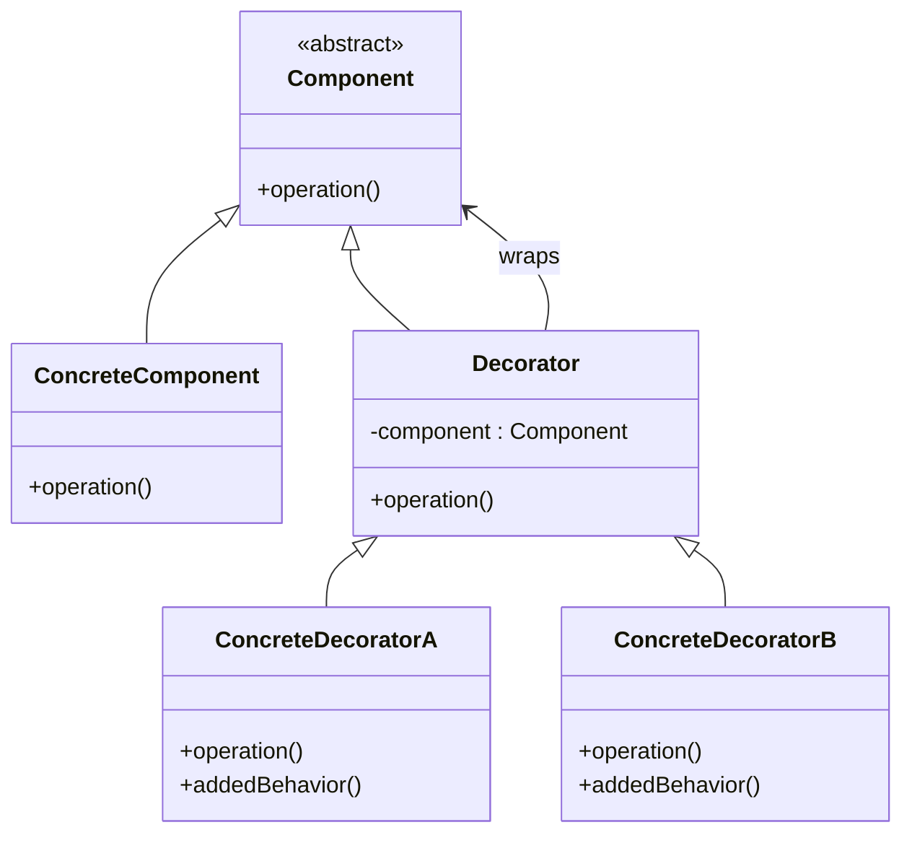
```mermaid
classDiagram
    class Component {
        <<abstract>>
        +operation()
    }
    class ConcreteComponent {
        +operation()
    }
    class Decorator {
        -component : Component
        +operation()
    }
    class ConcreteDecoratorA {
        +operation()
        +addedBehavior()
    }
    class ConcreteDecoratorB {
        +operation()
        +addedBehavior()
    }

    Component <|-- ConcreteComponent
    Component <|-- Decorator
    Decorator <|-- ConcreteDecoratorA
    Decorator <|-- ConcreteDecoratorB
    Decorator --> Component : wraps
```

#### 模式角色

| 角色 | 说明 |
|------|------|
| **Component（抽象构件）** | 定义对象的接口，可以给这些对象动态增加职责 |
| **ConcreteComponent（具体构件）** | 定义具体的构件对象，实现抽象构件中声明的方法 |
| **Decorator（抽象装饰类）** | 抽象构件类的子类，维持对抽象构件的引用 |
| **ConcreteDecorator（具体装饰类）** | 负责向构件添加新的职责 |

#### 优点

- 可以提供比继承更多的灵活性
- 可以通过一种动态的方式来扩展一个对象的功能
- 通过使用不同的具体装饰类以及这些装饰类的排列组合，可以创造出很多不同行为的组合
- 具体构件类与具体装饰类可以独立变化，符合**开闭原则**

#### 缺点

- 进行系统设计时将产生很多小对象，增加系统的复杂度
- 比继承更加容易出错，排错也很困难，对于多次装饰的对象，调试时需要逐级排查

#### 适用场景

- 在不影响其他对象的情况下，以动态、透明的方式给单个对象添加职责
- 需要动态地给一个对象增加功能，这些功能也可以动态地被撤销
- 当不能采用继承的方式对系统进行扩充或者采用继承不利于系统扩展和维护时（如大量独立的扩展导致子类爆炸性增长，或类定义不能继承如 `final` 类）

#### 模式扩展

- **透明装饰模式**：要求客户端完全针对抽象编程，不声明具体构件类型和具体装饰类型
- **半透明装饰模式**：允许客户端声明具体装饰者类型的对象，调用在具体装饰者中新增的方法

---

### 3.5 外观模式

**参考课件**：`09结构型模式.pdf`

#### 定义

外观模式（Facade Pattern）：外部与一个子系统的通信必须通过一个统一的外观对象进行，为子系统中的一组接口提供一个一致的界面，外观模式定义了一个高层接口，这个接口使得这一子系统更加容易使用。外观模式又称为门面模式，是一种**对象结构型模式**。

> Facade Pattern: Provide a unified interface to a set of interfaces in a subsystem. Facade defines a higher-level interface that makes the subsystem easier to use.

#### UML 类图

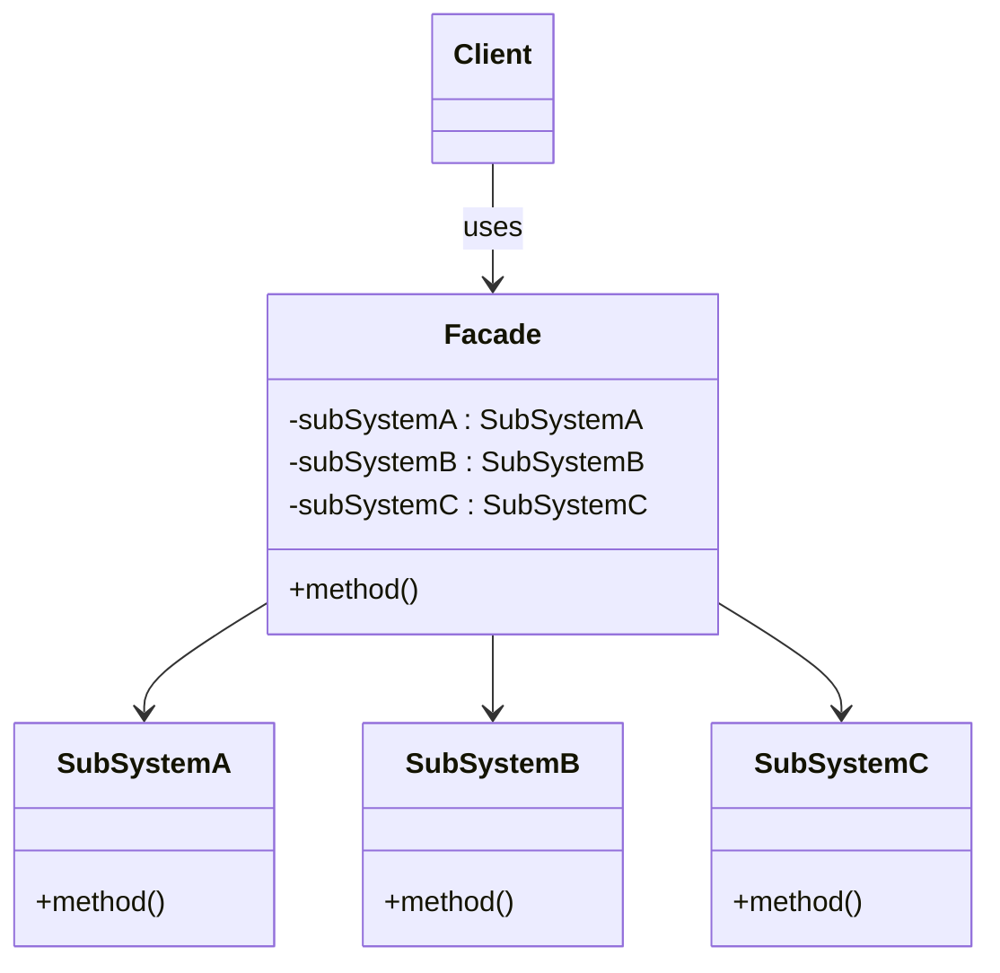
```mermaid
classDiagram
    class Facade {
        -subSystemA : SubSystemA
        -subSystemB : SubSystemB
        -subSystemC : SubSystemC
        +method()
    }
    class SubSystemA {
        +method()
    }
    class SubSystemB {
        +method()
    }
    class SubSystemC {
        +method()
    }
    class Client {
    }

    Client --> Facade : uses
    Facade --> SubSystemA
    Facade --> SubSystemB
    Facade --> SubSystemC
```

#### 模式角色

| 角色 | 说明 |
|------|------|
| **Facade（外观角色）** | 在客户端直接调用，知道相关子系统的功能和责任，将所有从客户端发来的请求委派到相应的子系统 |
| **SubSystem（子系统角色）** | 实现子系统的功能，处理外观对象传递的请求 |

#### 优点

- 对客户屏蔽子系统组件，减少了客户处理的对象数目并使子系统使用起来更加容易
- 实现了子系统与客户之间的松耦合关系
- 降低了大型软件系统中的编译依赖性，简化了系统在不同平台之间的移植过程
- 只是提供了一个访问子系统的统一入口，并不影响用户直接使用子系统类

#### 缺点

- 不能很好地限制客户使用子系统类
- 在不引入抽象外观类的情况下，增加新的子系统可能需要修改外观类或客户端的源代码，违背**开闭原则**

#### 适用场景

- 要为一个复杂子系统提供一个简单接口
- 客户程序与多个子系统之间存在很大的依赖性
- 在层次化结构中，可以使用外观模式定义系统中每一层的入口，降低层之间的耦合度

#### 设计原则体现

- 外观模式是**迪米特法则**的体现，通过引入外观类降低原有系统的复杂度，同时降低客户类与子系统类的耦合度
- 外观模式也是**单一职责原则**的应用，将一个系统划分为若干个子系统

---

### 3.6 享元模式

**参考课件**：`09结构型模式.pdf`

#### 定义

享元模式（Flyweight Pattern）：运用共享技术有效地支持大量细粒度对象的复用。系统只使用少量的对象，而这些对象都很相似，状态变化很小，可以实现对象的多次复用。由于享元模式要求能够共享的对象必须是细粒度对象，因此它又称为轻量级模式，是一种**对象结构型模式**。

> Flyweight Pattern: Use sharing to support large numbers of fine-grained objects efficiently.

#### 核心概念

- **内部状态（Intrinsic State）**：存储在享元对象内部并且不会随环境改变而改变的状态，因此**可以共享**
- **外部状态（Extrinsic State）**：随环境改变而改变的、**不可以共享**的状态。由客户端保存，在需要的时候再传入到享元对象内部

#### UML 类图

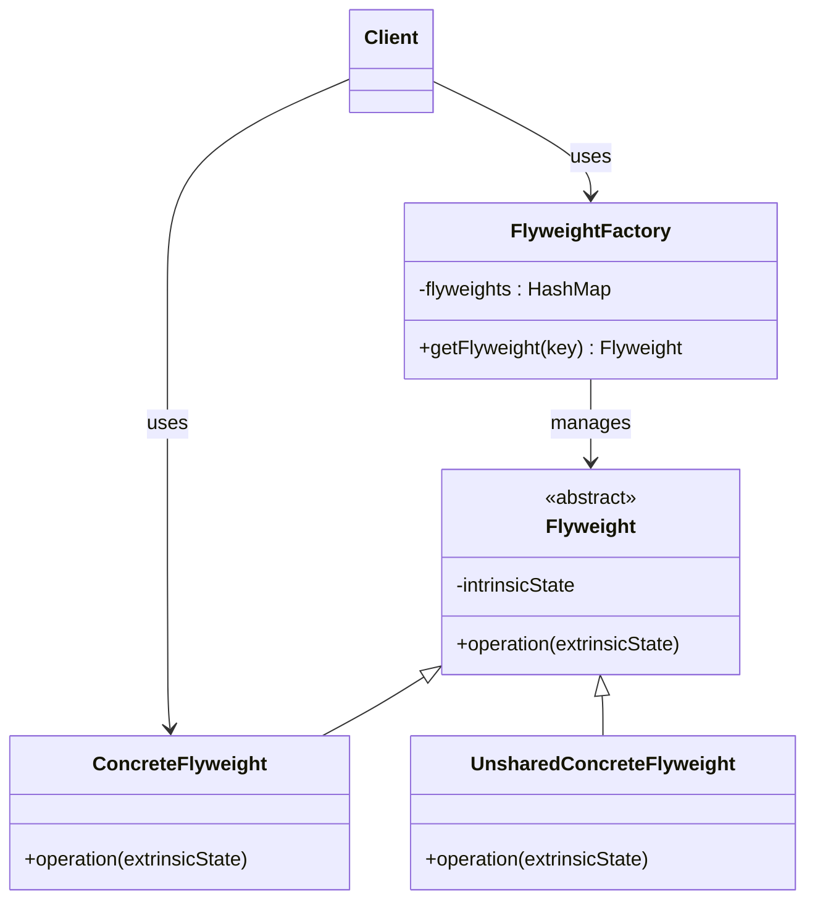
```mermaid
classDiagram
    class FlyweightFactory {
        -flyweights : HashMap
        +getFlyweight(key) Flyweight
    }
    class Flyweight {
        <<abstract>>
        -intrinsicState
        +operation(extrinsicState)
    }
    class ConcreteFlyweight {
        +operation(extrinsicState)
    }
    class UnsharedConcreteFlyweight {
        +operation(extrinsicState)
    }
    class Client {
    }

    FlyweightFactory --> Flyweight : manages
    Flyweight <|-- ConcreteFlyweight
    Flyweight <|-- UnsharedConcreteFlyweight
    Client --> FlyweightFactory : uses
    Client --> ConcreteFlyweight : uses
```

#### 模式角色

| 角色 | 说明 |
|------|------|
| **Flyweight（抽象享元类）** | 声明接口，通过它可以接受并作用于外部状态 |
| **ConcreteFlyweight（具体享元类）** | 实现抽象享元接口，其实例称为享元对象，存储内部状态 |
| **UnsharedConcreteFlyweight（非共享具体享元类）** | 不能被共享的抽象享元类的子类 |
| **FlyweightFactory（享元工厂类）** | 创建并管理享元对象，将各种类型的具体享元对象存储在享元池中 |

#### 优点

- 可以极大减少内存中对象的数量，使得相同对象或相似对象在内存中只保存一份
- 外部状态相对独立，不会影响内部状态，使得享元对象可以在不同的环境中被共享

#### 缺点

- 使得系统更加复杂，需要分离出内部状态和外部状态
- 为了使对象可以共享，需要将享元对象的状态外部化，读取外部状态使得运行时间变长

#### 适用场景

- 一个系统有大量相同或者相似的对象，由于这类对象的大量使用，造成内存的大量耗费
- 对象的大部分状态都可以外部化，可以将这些外部状态传入对象中
- 应当在多次重复使用享元对象时才值得使用享元模式

#### 与其他模式的联用

- 享元工厂类中通常使用**简单工厂模式**来生成享元对象
- 享元工厂类可以使用**单例模式**进行设计
- 享元模式可以结合**组合模式**形成复合享元模式

---

### 3.7 代理模式

**参考课件**：`09结构型模式.pdf`

#### 定义

代理模式（Proxy Pattern）：给某一个对象提供一个代理，并由代理对象控制对原对象的引用。代理模式的英文叫做 Proxy 或 Surrogate，是一种**对象结构型模式**。

> Proxy Pattern: Provide a surrogate or placeholder for another object to control access to it.

#### UML 类图

```mermaid
classDiagram
    class Subject {
        <<interface>>
        +request()
    }
    class Proxy {
        -realSubject : RealSubject
        +preRequest()
        +request()
        +postRequest()
    }
    class RealSubject {
        +request()
    }

    Subject <|-- Proxy
    Subject <|-- RealSubject
    Proxy --> RealSubject : controls
```

#### 模式角色

| 角色 | 说明 |
|------|------|
| **Subject（抽象主题角色）** | 声明真实主题和代理主题的共同接口 |
| **Proxy（代理主题角色）** | 内部包含对真实主题的引用，可以在任何时候操作真实主题对象 |
| **RealSubject（真实主题角色）** | 定义代理角色所代表的真实对象，实现真实的业务操作 |

#### 常见代理类型

| 类型 | 说明 |
|------|------|
| **远程代理（Remote Proxy）** | 为一个位于不同地址空间的对象提供本地代表，隐藏网络细节 |
| **虚拟代理（Virtual Proxy）** | 创建一个消耗相对较小的对象代表大对象，真实对象只在需要时才被创建 |
| **保护代理（Protect/Access Proxy）** | 控制对一个对象的访问，给不同用户提供不同级别的使用权限 |
| **Copy-on-Write 代理** | 虚拟代理的一种，将复制操作延迟到客户端真正需要时才执行 |
| **缓冲代理（Cache Proxy）** | 为某一个目标操作的结果提供临时的存储空间 |
| **防火墙代理（Firewall Proxy）** | 保护目标不让恶意用户接近 |
| **智能引用代理（Smart Reference Proxy）** | 在对象被引用时提供额外操作（如记录调用次数） |

#### 优点

- 能够协调调用者和被调用者，在一定程度上降低了系统的耦合度
- 远程代理使客户端可以访问在远程机器上的对象
- 虚拟代理通过小对象代表大对象，减少系统资源的消耗
- 保护代理可以控制对真实对象的使用权限

#### 缺点

- 由于在客户端和真实主题之间增加了代理对象，有些类型的代理模式可能会造成请求的处理速度变慢
- 实现代理模式需要额外的工作，有些代理模式的实现非常复杂

#### 适用场景

根据代理类型不同：
- 需要使用本地代理访问远程对象 → **远程代理**
- 创建开销大的对象需要延迟加载 → **虚拟代理**
- 需要控制不同用户的访问权限 → **保护代理**
- 需要为被引用的对象提供额外操作 → **智能引用代理**

---

## 模式分类总览

| 模式 | 分类 | 课件位置 |
|------|------|----------|
| 策略模式（Strategy） | 对象行为型 | `02策略模式.pdf` |
| 简单工厂（Simple Factory） | 类创建型 | `03工厂模式.pdf` |
| 工厂方法（Factory Method） | 类创建型 | `03工厂模式.pdf` |
| 抽象工厂（Abstract Factory） | 对象创建型 | `03工厂模式.pdf` |
| 单例模式（Singleton） | 对象创建型 | `补充-单例模式.pdf` |
| 建造者模式（Builder） | 对象创建型 | `04创建型模式.pdf` |
| 原型模式（Prototype） | 对象创建型 | `04创建型模式.pdf` |
| 状态模式（State） | 对象行为型 | `05状态与命令模式.pdf` |
| 命令模式（Command） | 对象行为型 | `05状态与命令模式.pdf` |
| 观察者模式（Observer） | 对象行为型 | `06行为型模式.pdf` |
| 中介者模式（Mediator） | 对象行为型 | `06行为型模式.pdf` |
| 模板方法（Template Method） | 类行为型 | `06行为型模式.pdf` |
| 迭代器模式（Iterator） | 对象行为型 | `补充-迭代器模式.pdf` |
| 适配器模式（Adapter） | 类/对象结构型 | `07适配器与组合.pdf` |
| 组合模式（Composite） | 对象结构型 | `07适配器与组合.pdf` |
| 桥接模式（Bridge） | 对象结构型 | `08桥接与装饰者.pdf` |
| 装饰模式（Decorator） | 对象结构型 | `08桥接与装饰者.pdf` |
| 外观模式（Facade） | 对象结构型 | `09结构型模式.pdf` |
| 享元模式（Flyweight） | 对象结构型 | `09结构型模式.pdf` |
| 代理模式（Proxy） | 对象结构型 | `09结构型模式.pdf` |

---

> **说明**：本文档严格按照课件中的顺序和内容整理，定义优先使用课件中的中文表述并配合 GoF 英文原文，UML 类图使用 Mermaid 语法绘制。
